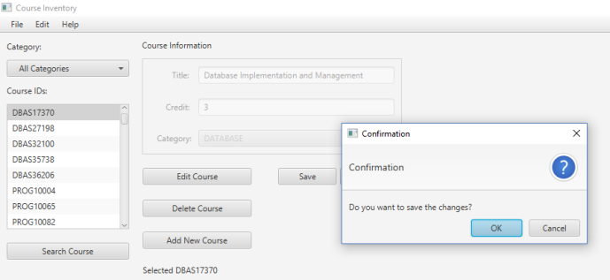

# Course Inventory 

Course Inventory is a Java project for dealing with CRUD process

### Requirements
* JDK v10
* Netbeans
* Scene Builder

## Development
```
$ File I/O
$ FileCHooser
$ EventHandler
$ Lambda Expression
$ ChangeListener
$ Callback interface
$ CellFactory
$ Property Binding
```
## Visuals



